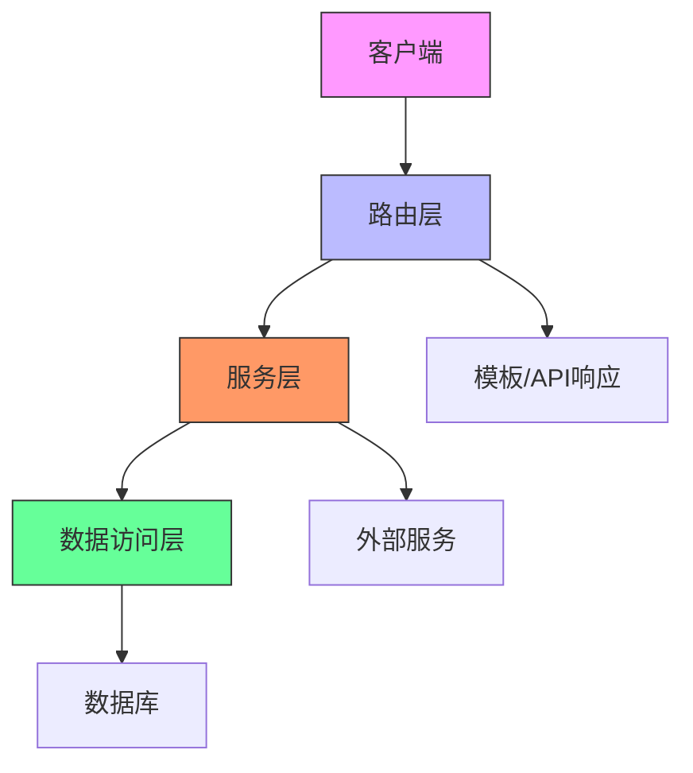

# CATalogue 新架构设计文档

## 架构图


## 各层职责

### 路由层(app/routes/, app/api/)
- 处理HTTP请求/响应
- 参数验证
- 权限检查
- 调用服务层

### 服务层(app/services/)
- 业务逻辑实现
- 事务管理
- 调用数据访问层
- 集成外部服务

### 数据访问层(app/repositories/)
- 数据库操作
- 缓存管理
- 数据模型转换

### 核心组件(app/core/)
- 配置管理
- 依赖注入容器
- 公共工具类
- 中间件

## 接口定义

### 服务层接口示例
```python
class ICatService(ABC):
    @abstractmethod
    def search_cats(self, keyword: str) -> List[Cat]:
        pass
```

### 数据访问层接口示例
```python
class ICatRepository(ABC):
    @abstractmethod
    def find_by_name(self, name: str) -> Optional[Cat]:
        pass
```

## 依赖关系
- 路由层依赖服务层接口
- 服务层依赖数据访问层接口
- 所有层依赖核心组件
- 禁止跨层调用(如路由层直接访问数据库)
